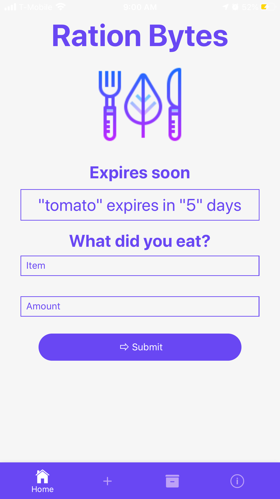
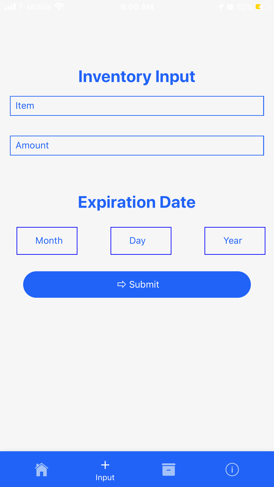
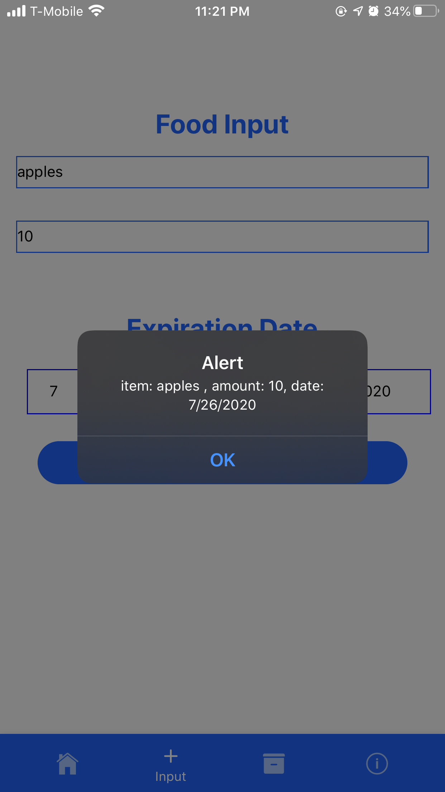
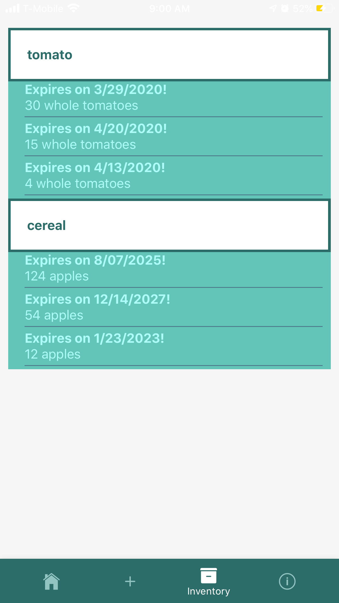
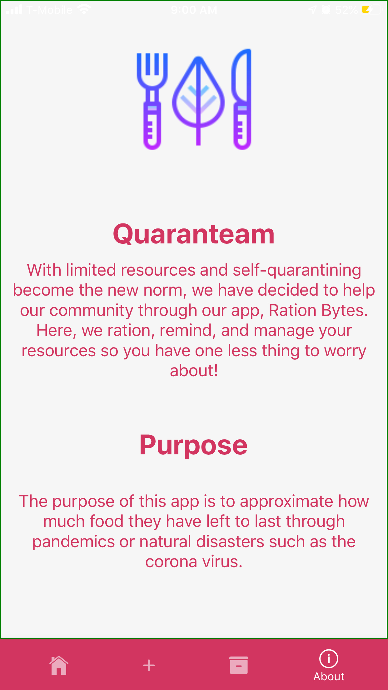

# Ration Bytes
Amidst ongoing fears of Covid-19, people have been panic buying and it has become a struggle to get the supplies you need. Everyday items have become limited. Therefore, this mobile app guides you through methods of rationing, managing your inventory, and reminding you when you are low on goods.

## LAHacks 2020 Submission
[Submission for Quaranteam Challenge](https://devpost.com/software/ration-bytes)

## Demo
[Video Demo](https://devpost.com/software/ration-bytes)

## What it does
iOS mobile app that lets you add an item you wish to stock into your inventory through the Input Page. View list of all items in the Inventory Page. Update your usage of items in the Home Page. And most importantly, reminds the user when their most pressing expiration date is coming. 

## App Structure (4 Pages)
1. Home Page
2. Input Page
3. Inventory Page
4. Info Page

### Main Page 
The Home Page launches after a loading screen (Image 1). The Home Page is where users can update any usage of their items. There is also a reminder for the most pressing expiration date that is approaching (Image 2).   

### Input Page
The Input Page lets you add new items to your inventory (Image 1). When adding a new item or updating any value of an item, alerts are displayed while also saving the data through AsyncStorage (Image 2).  

### Inventory Page
Inventory Page consists of a list of all items.  

### Info Page
Displays mission statement.  

